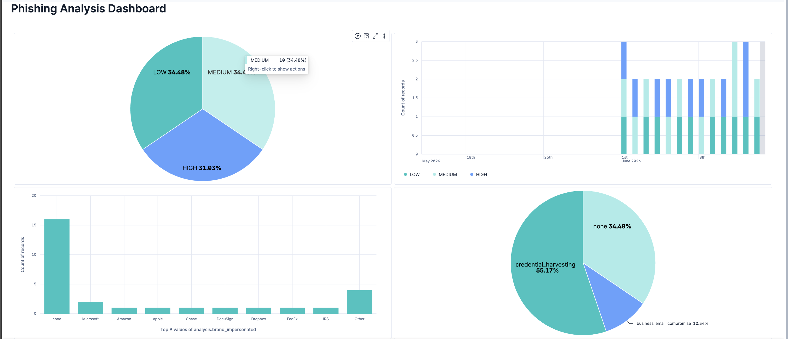
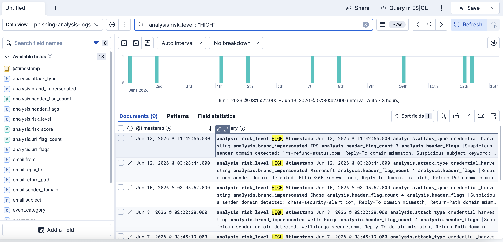
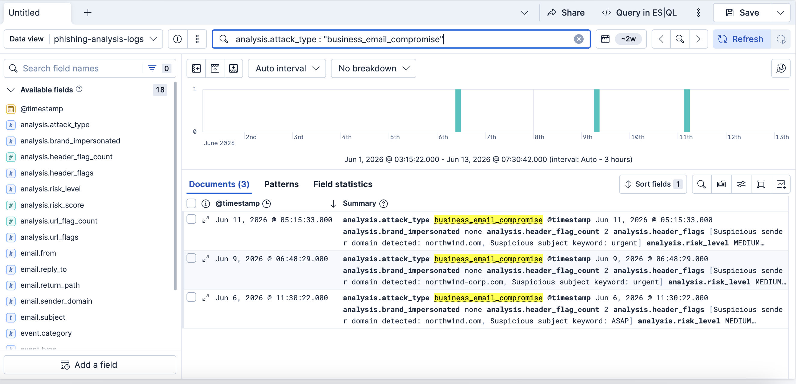
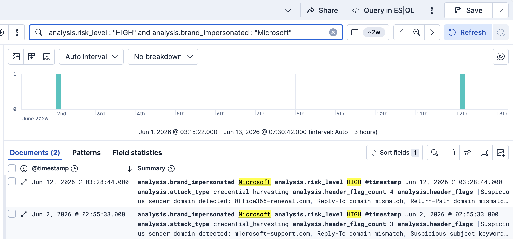

# Elastic Phishing Analysis Lab 🔍

A hands-on Elastic Security / Kibana lab demonstrating SIEM-based phishing triage — ingesting phishing analysis logs, querying with KQL, and building operational dashboards for incident response.

This lab extends the [Phishing Email Analyzer](https://github.com/shayvon-ballard/phishing-email-analyzer) by showing what happens after detection: analysis results flow into a SIEM, where an IR analyst queries, filters, and visualizes them to prioritize response.

## Dashboard



## What This Demonstrates

- **KQL (Kibana Query Language)** — filtering phishing alerts by severity, attack type, and impersonated brand using single and compound queries
- **Elastic Security data ingestion** — structuring and importing phishing analysis logs into Elasticsearch with proper field mappings
- **Dashboard creation** — building operational visualizations that support real-time triage decisions
- **SIEM-based investigation workflow** — the same query-filter-visualize loop an IR analyst runs daily

## KQL Queries

### Filter by risk level — triage the highest-severity alerts first

```
analysis.risk_level : "HIGH"
```



### Isolate BEC attacks — hunt for business email compromise

```
analysis.attack_type : "business_email_compromise"
```



### Compound query — drill into a specific campaign

```
analysis.risk_level : "HIGH" and analysis.brand_impersonated : "Microsoft"
```



## Dashboard Panels

The dashboard provides four operational views for phishing triage:

**Risk Level Distribution** — Pie chart showing the proportion of HIGH, MEDIUM, and LOW alerts. Gives an at-a-glance read on overall threat posture and helps gauge analyst workload.

**Phishing Alerts Over Time** — Stacked bar chart tracking daily alert volume by severity. Reveals spikes and trends — a sudden cluster of HIGH alerts may indicate a coordinated campaign.

**Top Impersonated Brands** — Bar chart ranking which brands attackers are spoofing most frequently (Microsoft, Amazon, Apple, Chase, etc.). Informs targeted user-awareness training and detection-rule tuning.

**Attack Type Breakdown** — Pie chart splitting volume between credential harvesting (55%), business email compromise (10%), and clean/legitimate mail (35%). Shows the threat mix hitting the organization.

## Data & Field Schema

The dataset contains 30 phishing analysis log records structured in NDJSON format with the following fields:

| Field | Type | Description |
|---|---|---|
| `@timestamp` | date | When the email was analyzed |
| `event.category` | keyword | Always "email" |
| `event.type` | keyword | "alert" for flagged emails, "info" for clean |
| `email.from` | keyword | Displayed sender address |
| `email.reply_to` | keyword | Reply-To header value |
| `email.return_path` | keyword | Return-Path header value |
| `email.subject` | keyword | Email subject line |
| `email.sender_domain` | keyword | Extracted sender domain |
| `threat.indicator.urls` | keyword | Suspicious URLs found in the email body |
| `analysis.header_flags` | keyword | Header-based indicators that fired |
| `analysis.url_flags` | keyword | URL-based indicators that fired |
| `analysis.header_flag_count` | integer | Number of header flags |
| `analysis.url_flag_count` | integer | Number of URL flags |
| `analysis.risk_score` | integer | Composite score (0-100) |
| `analysis.risk_level` | keyword | HIGH (75-100), MEDIUM (40-74), LOW (0-39) |
| `analysis.attack_type` | keyword | credential_harvesting, business_email_compromise, or none |
| `analysis.brand_impersonated` | keyword | Spoofed brand name, or "none" |
| `observer.name` | keyword | Source tool: "phishing-email-analyzer" |

Field names follow [Elastic Common Schema (ECS)](https://www.elastic.co/guide/en/ecs/current/index.html) conventions where applicable, making the data compatible with production Elastic Security deployments.

## How to Reproduce

1. Sign up for a free trial at [cloud.elastic.co](https://cloud.elastic.co)
2. Create an **Elastic Cloud Serverless** deployment with a **Security** project
3. Navigate to **Machine Learning** then **File Upload**
4. Upload `data/phishing_logs.ndjson` with the index name `phishing-analysis-logs`
5. Open **Discover**, set the data view to `phishing-analysis-logs`, and set the time range to **Last 30 days**
6. Run the KQL queries above in the search bar
7. Open **Dashboards**, create a new dashboard, and build visualizations using the fields in the schema table

## How This Maps to Incident Response

This lab mirrors the daily workflow of an IR analyst handling reported phishing:

| Lab activity | IR equivalent |
|---|---|
| Ingesting structured logs into Elasticsearch | SIEM log pipeline — email gateway and detection tool output feeding into the analyst's workspace |
| KQL filtering by risk level | **Alert triage** — working HIGH-severity incidents first |
| KQL filtering by attack type | **Threat hunting** — proactively searching for BEC or credential-harvesting campaigns |
| Compound queries (severity + brand) | **Campaign analysis** — correlating indicators to identify coordinated attacks |
| Dashboard visualizations | **Operational awareness** — monitoring phishing volume, trends, and brand-targeting patterns across the organization |

## Sample Data Attribution

All 30 log records are synthetic, generated specifically for this lab. No real phishing emails, threat intelligence feeds, or production SIEM data were used.

- **Typosquatted domains** (`paypa1-secure.com`, `m1crosoft-support.com`, `app1e-id-verify.com`, etc.) are fabricated using documented look-alike techniques (letter/number substitution). Brands are referenced only as impersonation targets, mirroring how real phishing abuses trusted names.
- **IP addresses** are all RFC 1918 private ranges (`192.168.x.x`, `10.0.0.x`, `172.16.x.x`) — non-routable by design, guaranteed to never reach a real host.
- **URL shortener slugs** (`bit.ly/3xZpw2q`, etc.) are invented and resolve nowhere.
- **"Northwind"** is a fictional company (Microsoft sample database convention). All employee names are fabricated.
- **Attack categories** include credential harvesting (brand spoofing), business email compromise (executive impersonation), and clean/legitimate internal mail — representing realistic IR triage volume.
- Records simulate the output of the [Phishing Email Analyzer](https://github.com/shayvon-ballard/phishing-email-analyzer) being ingested into a SIEM, using the same scoring methodology and field structure the tool produces.

No live malicious content exists anywhere in this repository.

## Tech Stack

- Elastic Cloud Serverless (Security)
- Kibana (Discover + Dashboard + Lens)
- KQL (Kibana Query Language)
- NDJSON for data ingestion

## Related Projects

- [Phishing Email Analyzer](https://github.com/shayvon-ballard/phishing-email-analyzer) — the Python-based detection tool whose output this lab ingests and visualizes
- [ThreatTrace](https://github.com/shayvon-ballard/threat-trace) — SIEM log analyzer with MITRE ATT&CK-mapped detection rules

## Author

ShayVon Ballard

- GitHub: [github.com/shayvon-ballard](https://github.com/shayvon-ballard)
